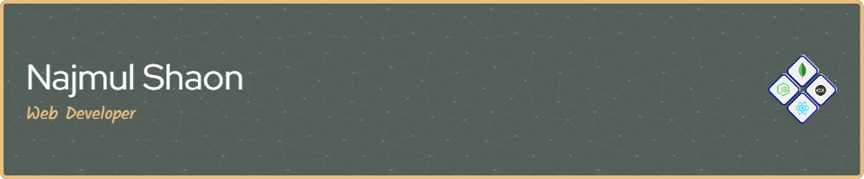

<h2 align="center">📊  Current Stats</h2>

###

  

<h2 align="center">👩‍💻  About Me</h2>

###

I am a Web Developer specializing in JavaScript, React.js, Tailwind CSS, and the MERN stack. Recently, I’ve been focusing on building full-stack applications with React and Express.js, along with MongoDB for backend development. I’m passionate about creating seamless web applications with a strong focus on design and functionality. While I don’t know everything, I’m always eager to learn—currently, I plan to dive deeper into TypeScript, Mongoose, and Next.js to expand my skill set.

###

  
  
  

###

<h2 align="left">📞  Reach me out</h2>

###

  
  

###

<h2 align="left">👁️👁️  Current Overview</h2>

###

🔭 Currently: Improving MERN stack skills. 📚 I'm currently learning TypeScript and Next.js 🎯 Goals: Make web applications that make life easy. 🎲 Fun fact: Loves the view from the hills—just not the "falling off" part!

###

###
<h2 align="left">🖊️  Crafting with</h2>

###

  
  
  
  
  
  
  
  
  
  
  
  
  
  
  
  
  
  
  

###
